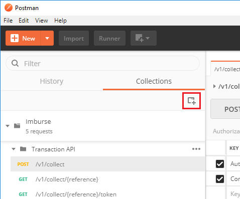
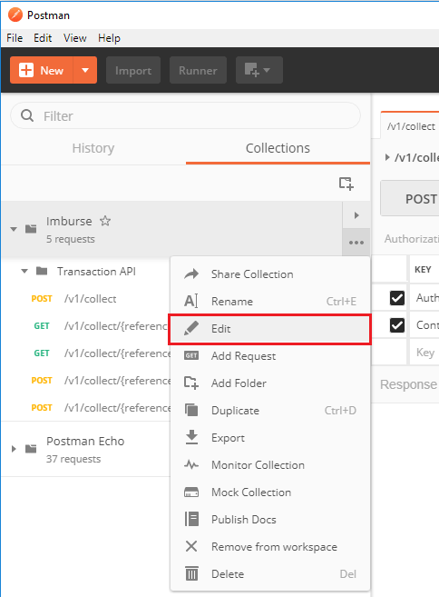
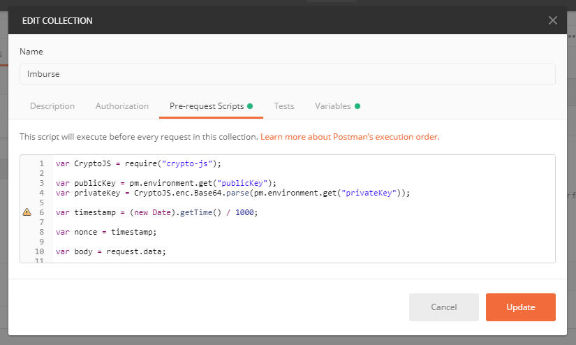
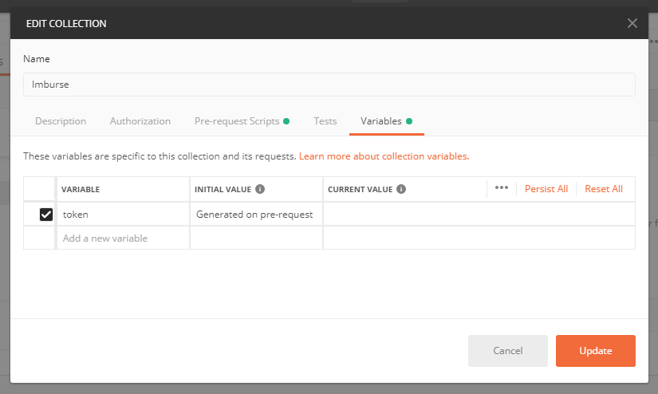
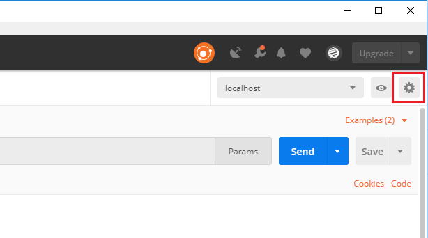
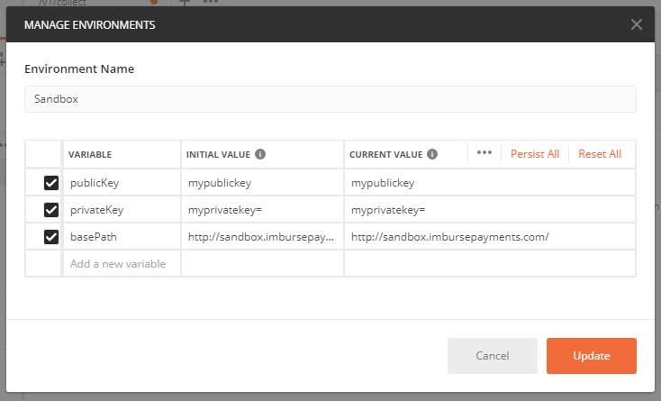
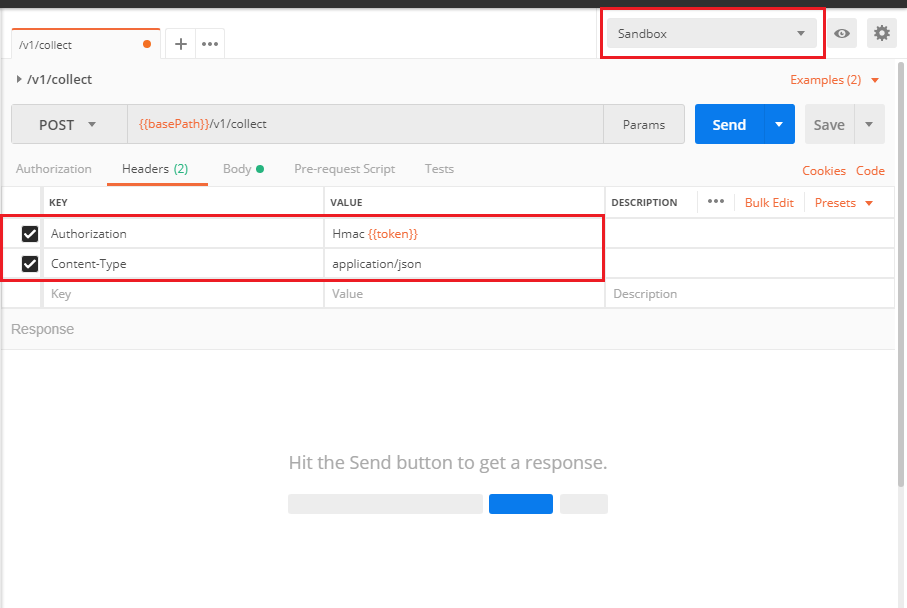

# Postman Example

One of the simplest ways of playing with any of the Imburse API's is through the popular [Postman tool](https://www.getpostman.com/).

The following guide will show you how to set up an automated pre-request script to generate HMAC signatures for your requests.

#### If you are already familiar with Postman pre-request scripts, variables and environment variables then here's the tl;dr:

 - Copy the `pre-request.js` contents into a pre-request script block at any level (collection, folder, request)
 - Set environment variables `publicKey` and `privateKey` as generated in the Imburse client portal
 - Include the HMAC header `Authorize: hmac {{token}} ` in your request headers.
 - Done. The `{{token}}` variable will be replaced with the signed request body on each request.

## Setup 

### Step 1

#### Create (or edit) a new collection.

Create a new collection

Edit an existing collection

### Step 2

#### Add a Pre-request script to the collection.

Copy the contents of `pre-request.js` into the editor window.

### Step 3

#### Add a variable to the collection

Add a collection variable named `token`.

The `INITIAL VALUE` and `CURRENT VALUE` are not used. This variable is set by the pre-request script for each individual request.

### Step 4 

#### Create an environment

The environment will be responsible for housing `{{basePath}}`, `{{publicKey}}` and `{{privateKey}}` variables.

In this example I called my new environment `Sandbox`.

### Step 5 

#### Add your environment variables

The `INITIAL VALUE` and `CURRENT_VALUE` should be identical.

You can fetch your public and private keys from the Imburse Client Portal.

Information about which `basePath` to use is available in the API documentation.

### Step 6

#### Issue a request

Firstly make sure you have selected your newly created environment. This will allow the Pre-request script created in *Step 2* to generate a `{{token}}` variable for this request.

Second, add the required API headers. Both `Authorization` and `Content-Type` headers shown below are required.

Key | Value
- | -
`Authorization` | `Hmac {{token}}`
`Content-Type` | `application/json`

Optionally, if you specified a `basePath` variable in your environment you can use this in your Request URL field.

### Done!

As mentioned briefly in the introduction the pre-request script can actually be set at any level. That is, at a collection, a folder or at a request level.

As the number of endpoints you test against grows we have found it more beneficial to put the Pre-request script at the collection level rather than at the folder or request level however any should work.